# Waygate Product Delivery

[](plugins/waygate-product-delivery)
[](plugins/waygate-product-delivery/.codex-plugin/plugin.json)
[](#verify)
[](LICENSE)
[](README.zh-CN.md)

Waygate Product Delivery is a Codex-native plugin for moving a product idea through product framing, Open Spec, scenario review, UI or non-UI gates, implementation handoff, and formal closure evidence.

It is designed for teams that want AI-assisted implementation to stay inside a visible delivery process: every major transition is backed by local artifacts, user confirmations, review gates, test obligations, and a canonical closure validator.

> Read this in Chinese: [README.zh-CN.md](README.zh-CN.md)

## Why This Exists

AI coding agents can move fast, but long-running product work often fails in predictable ways:

- context compression loses process state;
- a prototype is created but not confirmed after revisions;
- tests are written, but not mapped back to user journeys;
- implementation starts before review gates are complete;
- closure is claimed from chat summaries or repo-local scripts instead of canonical evidence.

Waygate Product Delivery turns those failure modes into explicit gates.

## What It Does

| Capability | Result |
| --- | --- |
| Dormant-by-default activation | The plugin does nothing until the project explicitly says `启动交付` or `start`. |
| File-backed workflow state | `.product-delivery/state.json` and artifacts outlive chat context and compaction. |
| Required skill gates | Product Delivery, Open Spec, planning files, UI/UX, browser testing, and closure skills are checked by stage. |
| UI prototype gate | UI projects require a current-feature local 1:1 HTML prototype and explicit user confirmation. |
| Non-UI behavior gate | API, CLI, service, and background-job projects use behavior contracts instead of HTML prototypes. |
| Multi-agent review artifacts | Scenario and test coverage reviews must be visible artifacts, not vague chat claims. |
| Goal-driven implementation | Implementation must follow the planned task queue and cannot stop early without a blocker. |
| Canonical closure authority | Final completion depends on Product Delivery's validator, not on target-project shortcuts. |

## Quick Start

Clone the repository:

```bash
git clone https://github.com/likunkun/waygate-product-delivery.git
cd waygate-product-delivery
```

Install or update the local Codex plugin:

```bash
bash scripts/install_waygate_product_delivery.sh
```

Start a new Codex thread after installation, then activate the workflow inside the project you want to deliver:

```text
启动交付
```

Real spawned-subagent review gates are required by default. If subagents are unavailable and you explicitly accept weaker evidence, start with:

```text
启动交付，允许降级评审
```

## Install

The installable plugin is generated under:

```text
plugins/waygate-product-delivery/
```

The repository-local marketplace entry is:

```text
.agents/plugins/marketplace.json
```

Automated install:

```bash
bash scripts/install_waygate_product_delivery.sh
```

Manual install:

```bash
python3 scripts/package_waygate_product_delivery.py
python3 <plugin-creator>/scripts/validate_plugin.py plugins/waygate-product-delivery
python3 <plugin-creator>/scripts/update_plugin_cachebuster.py plugins/waygate-product-delivery
codex plugin add waygate-product-delivery@repo-local
```

Build the distributable archive:

```bash
python3 scripts/package_waygate_product_delivery.py
```

This creates:

```text
dist/waygate-product-delivery-1.0.12.tar.gz
```

## Use In Codex

| Prompt | Meaning |
| --- | --- |
| `启动交付` | Activate Product Delivery mode for the current project. |
| `启动交付，允许降级评审` | Activate Product Delivery and explicitly allow role-simulation review only when spawned subagents are unavailable. |
| `查看状态` | Show the current Product Delivery stage, blockers, and next gate. |
| `验证闭包` | Run formal closure validation against current artifacts. |
| `停止交付` | Exit Product Delivery intervention for the current project. |

Implementation must not begin until the current feature has:

1. current-feature Open Spec documents;
2. scenario matrix and multi-agent scenario review artifacts;
3. user-confirmed freeze;
4. UI prototype confirmation or non-UI behavior contract confirmation;
5. passed test coverage audit;
6. passed multi-agent test coverage review;
7. planned E2E obligations and accepted exemptions confirmed by the user;
8. implementation launch authorization.

## Workflow

```mermaid
flowchart LR
    A[Start] --> B[Product brief]
    B --> C[Open Spec]
    C --> D[Project type decision]
    D --> E[Scenario matrix]
    E --> F[Multi-agent scenario review]
    F --> G[User-confirmed freeze]
    G --> H{Project type}
    H -->|UI| I[1:1 HTML prototype]
    H -->|Non-UI| J[Behavior contract]
    I --> K[User confirmation]
    J --> K
    K --> L[Test coverage audit]
    L --> M[Multi-agent test coverage review]
    M --> N[Planned E2E obligations]
    N --> O[Planned E2E user confirmation]
    O --> P[Implementation launch authorization]
    P --> Q[Codex Goal handoff]
    Q --> R[Task queue execution]
    R --> S[Executed evidence]
    S --> T[Multi-agent test implementation review]
    T --> U[Canonical closure validator]
```



The key rule is simple: artifacts and state are authoritative; chat summaries are not.

## Architecture

```text
waygate-product-delivery
|-- src/product_delivery_agent/          Runtime library
|-- plugins/waygate-product-delivery/    Generated Codex plugin package
|-- docs/open-spec/                      Versioned Open Spec packages
|-- docs/operations/                     Install, monitoring, and hardening notes
|-- scripts/                             Package and install automation
|-- tests/                               Runtime and packaging regression tests
`-- .agents/plugins/marketplace.json     Repo-local Codex marketplace entry
```

Core runtime modules:

| Module | Responsibility |
| --- | --- |
| `workflow.py` | Product Delivery lifecycle API. |
| `artifact_protocol.py` | Local state and artifact persistence. |
| `startup_guard.py` | Planning files, Open Spec, and project-type gate checks. |
| `gatekeeper.py` | Fail-closed invariants for handoff, implementation, and closure. |
| `delivery_goal.py` | Task queue, task cursor, and stop guard. |
| `transition_journal.py` | Hash-linked critical transition journal. |
| `finalization.py` | Canonical Product Delivery closure validator entry point. |
| `plugin_packaging.py` | Codex plugin generation and distribution packaging. |

## Verify

Run the full test suite:

```bash
PYTHONPATH=src python3 -m unittest discover -s tests
```

Compile runtime modules:

```bash
python3 -m py_compile src/product_delivery_agent/*.py
```

Validate the generated plugin:

```bash
python3 <plugin-creator>/scripts/validate_plugin.py plugins/waygate-product-delivery
```

Smoke-test the installed validator without source `PYTHONPATH`:

```bash
env -u PYTHONPATH PYTHONNOUSERSITE=1 \
  python3 <codex-home>/plugins/cache/repo-local/waygate-product-delivery/<installed-version>/scripts/validate-closure-artifact.py --help
```

Current baseline:

```text
149 unit tests passing
Plugin validation passed
Packaged validator runs without source PYTHONPATH
```

## Documentation

| Document | Purpose |
| --- | --- |
| [CHANGELOG.md](CHANGELOG.md) | Release ledger and compact post-1.0 version direction. |
| [ROADMAP.md](ROADMAP.md) | Version roadmap and capability plan. |
| [docs/README.md](docs/README.md) | Documentation registry. |
| [docs/open-spec/README.md](docs/open-spec/README.md) | Open Spec package index from V0.1 through V1.0. |
| [docs/operations/waygate-product-delivery-installation.md](docs/operations/waygate-product-delivery-installation.md) | Build, package, install, and smoke-test instructions. |
| [docs/operations/product-delivery-agent-hardening-plan.md](docs/operations/product-delivery-agent-hardening-plan.md) | Hardening history from monitored delivery runs. |

## Boundaries

Waygate Product Delivery is not the Waygate controller.

It does:

- package a Codex workflow plugin;
- define product delivery gates;
- persist local Product Delivery state and artifacts;
- validate closure evidence.

It does not:

- mutate Waygate controller state;
- replace downstream project tests;
- claim production readiness from chat summaries;
- let target-project scripts become the final closure authority.

The internal Python import path remains `product_delivery_agent`; the external Codex plugin name is `waygate-product-delivery`.

## Contributing

Use the same discipline the plugin enforces:

1. Make behavior changes through Open Spec or a focused issue.
2. Add or update tests before changing runtime behavior.
3. Run the verification commands in [Verify](#verify).
4. Regenerate the plugin package when runtime or templates change.
5. Do not hand-edit terminal state to bypass closure validation.

## License

MIT. See [LICENSE](LICENSE).
