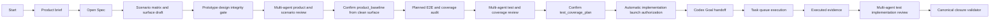

# Waygate Product Delivery

[](plugins/waygate-product-delivery)
[](plugins/waygate-product-delivery/.codex-plugin/plugin.json)
[](#verify)
[](LICENSE)
[](README.zh-CN.md)

Waygate Product Delivery is a Codex-native plugin for moving a product idea through product framing, Open Spec, scenario review, UI or non-UI gates, implementation handoff, and formal closure evidence. Shorthand commands: `start <slug> [multi-agent|role-play]`, `status`, `pause`, `resume`, `close`, `abandon`, `inspect`.

It is designed for teams that want AI-assisted implementation to stay inside a visible delivery process: every major transition is backed by local artifacts, user confirmations, review gates, test obligations, and a canonical closure validator.

> Read this in Chinese: [README.zh-CN.md](README.zh-CN.md)

## Why This Exists

AI coding agents can move fast, but long-running product work often fails in predictable ways:

- context compression loses process state;
- a prototype is created but not confirmed after revisions;
- tests are written, but not mapped back to user journeys;
- implementation starts before review gates are complete;
- closure is claimed from chat summaries or repo-local scripts instead of canonical evidence.

Waygate Product Delivery turns those failure modes into explicit gates.

## What It Does

| Capability | Result |
| --- | --- |
| Explicit-only lifecycle control | Lifecycle changes require `$waygate-product-delivery` with a strict JSON request; ordinary chat never mutates delivery state. |
| Delivery-isolated evidence | `.product-delivery/state.json` survives compaction while authoritative artifacts live under `deliveries/<feature_slug>/<delivery_id>/`. |
| Required skill gates | Product Delivery, Open Spec, planning files, UI/UX, browser testing, and closure skills are checked by stage. |
| Layered product confirmation | Product scope and the UI prototype or non-UI behavior contract are confirmed before detailed test design. |
| Prototype design integrity | Clean product surfaces must inherit the global product context, while review annotations remain on an external review-only surface. |
| Prototype-bound task execution | Every visible UI task binds an exact frozen prototype slice and must pass per-task semantic and visual conformance before completion. |
| Prototype-to-production conformance | UI closure requires frozen prototype contracts, production PNG and semantic evidence, plus an independent UI conformance review. |
| Non-UI behavior gate | API, CLI, service, and background-job projects use behavior contracts instead of HTML prototypes. |
| Multi-agent review artifacts | Scenario and test coverage reviews must be visible artifacts, not vague chat claims. |
| Goal-driven implementation | Implementation must follow the planned task queue and cannot stop early without a blocker. |
| Verified Host Goal continuation | Post-handoff turns and gates require fresh observations from Codex `get_goal`, `create_goal`, and `update_goal` tools. |
| Canonical closure authority | Final completion depends on Product Delivery's validator, not on target-project shortcuts. |

## Quick Start

Clone the repository:

```bash
git clone https://github.com/likunkun/waygate-product-delivery.git
cd waygate-product-delivery
```

Install or update the local Codex plugin:

```bash
bash scripts/install_waygate_product_delivery.sh
```

Start a new Codex thread after installation, then invoke the skill with shorthand commands:

```text
$waygate-product-delivery start v0-5-5-flow-preview multi-agent
```

Or use the full JSON form:

```text
$waygate-product-delivery {"schema_version":"v1","action":"start","feature_slug":"v0-5-5-flow-preview","start_mode":"resume_or_create","review_mode_if_created":"spawned_subagents_authorized"}
```

**Available shorthand commands:**

- `start <slug>` — start with pending review mode selection
- `start <slug> multi-agent` — start with spawned subagents (strong evidence)
- `start <slug> role-play` — start with role simulation (weak evidence)
- `status` — check current delivery status
- `pause` — pause current delivery
- `resume` — resume paused delivery
- `close` — close completed delivery
- `abandon` — abandon current delivery (two-phase)
- `inspect` — inspect startup request


Use `spawned_subagents_authorized` to authorize structured subagent reviews when a new delivery is created, or `role_simulation_allowed` only when degraded evidence is explicitly accepted. Repeating `resume_or_create` for the same unfinished feature resumes the existing `delivery_id`.

## Install

The installable plugin is generated under:

```text
plugins/waygate-product-delivery/
```

The repository-local marketplace entry is:

```text
.agents/plugins/marketplace.json
```

Automated install:

```bash
bash scripts/install_waygate_product_delivery.sh
```

The installer detects legacy `product-delivery-agent` config, cache, and registry entries, removes the legacy plugin through Codex, and fails unless the enabled product-delivery selection is only `waygate-product-delivery@repo-local`.

Manual install:

```bash
python3 scripts/package_waygate_product_delivery.py
python3 <plugin-creator>/scripts/validate_plugin.py plugins/waygate-product-delivery
python3 <plugin-creator>/scripts/update_plugin_cachebuster.py plugins/waygate-product-delivery
codex plugin add waygate-product-delivery@repo-local
```

Build the distributable archive:

```bash
python3 scripts/package_waygate_product_delivery.py
```

This creates:

```text
dist/waygate-product-delivery-1.0.33.tar.gz
```

## Use In Codex

| JSON action | Meaning |
| --- | --- |
| `inspect` / `status` | Read startup intent, current stage, blockers, migration status, and artifact identity without changing lifecycle state. |
| `start` | Create or resume according to `start_mode`: `resume_or_create`, `resume_only`, or `create_only`. |
| `pause` / `resume` | Temporarily disable or restore intervention while preserving the same `delivery_id` and evidence. |
| `prepare_abandon` / `abandon` | Permanently abandon a delivery through a state-bound, expiring two-phase token. |
| `close` | Close only after canonical closure, feature closure, and the delivery goal have passed. |

`stop()` is retired. Non-JSON requests and unknown fields are rejected without changing state.

Implementation must not begin until the current feature has:

1. current-feature Open Spec, scenario matrix, and UI prototype or non-UI behavior-contract draft;
2. a current `prototype_design_integrity` bundle for UI work, followed by passed multi-agent product/scenario review;
3. user-confirmed `product_baseline` for scope and the clean product surface;
4. planned E2E obligations, coverage audit, and detailed test design created after that baseline;
5. passed multi-agent test and test-coverage reviews;
6. user-confirmed `test_coverage_plan`;
7. automatic implementation launch authorization.

## Workflow


```mermaid
flowchart LR
    A[Start] --> B[Product brief]
    B --> C[Open Spec]
    C --> D[Scenario matrix and surface draft]
    D --> V[Prototype design integrity gate]
    V --> E[Multi-agent product and scenario review]
    E --> F[Confirm product_baseline from clean surface]
    F --> G[Planned E2E and coverage audit]
    G --> H[Multi-agent test and coverage review]
    H --> I[Confirm test_coverage_plan]
    I --> P[Automatic implementation launch authorization]
    P --> Q[Codex Goal handoff]
    Q --> R[Task queue execution]
    R --> S[Executed evidence]
    S --> T[Multi-agent test implementation review]
    T --> U[Canonical closure validator]
```

The key rule is simple: artifacts and state are authoritative; chat summaries are not.

### Prototype Gate And Review

For UI work, `record_ui_prototype_design_bundle()` runs before multi-agent product/scenario review. The deterministic gate rebuilds fixed-schema semantic snapshots and browser-preflight probe artifacts, verifies their snapshot/screenshot/region hashes for every required state and viewport, and ignores caller-reported pass flags. Each global shell, navigation, visual language, information density, component system, and responsive behavior row must bind a structured, hashed design-evidence artifact. The gate also enforces strict separation between the product-facing `clean_surface` and any external `review_annotation_set`.

The gate verifies objective facts; multi-agent review judges design quality. Reviewers decide whether the baseline is representative, whether local polish remains coherent with the whole product, and whether an exception is justified. They cannot waive a failed gate, and empty findings are not a substitute for positive review coverage.

Only the clean prototype and clean screenshots are shown for `product_baseline`. Annotation-only changes invalidate the bound internal scenario review, but not either user confirmation, the test plan, or launch authorization. Product-surface or product-context changes retain full downstream invalidation. Active v1.0.22 deliveries with an already confirmed baseline remain grandfathered until the prototype changes or the baseline is reopened. The workflow still has exactly two user confirmations: `product_baseline` and `test_coverage_plan`; closure remains schema `v0.11`.

### Host Goal Checkpoint Recovery

After handoff, Host Goal activation uses the exact `get_goal -> create_goal -> get_goal` protocol. If a legal canonical transition makes a pre-active activation checkpoint stale, call `recover_stale_host_goal_checkpoint(checkpoint_id)`. The runtime verifies the current delivery identity, authorization, binding generation and nonce, objective hash, and transition-journal hash chain before archiving the old checkpoint and issuing a fresh `inspect_before_activation` checkpoint.

Recovery preserves the delivery, artifacts, reviews, task state, and prior journal events. Do not edit `.product-delivery/state.json`, restart the delivery, or replay the superseded checkpoint. An active Waygate delivery must use the installed `waygate-product-delivery` runtime; do not mix writes from the legacy `product-delivery-agent@1.0.8` runtime.

### Coordinator-Owned Host Goal

Each delivery captures its top-level Codex coordinator from `CODEX_THREAD_ID`. Host Goal activation, reconciliation, observation, completion, and every post-handoff canonical write require the current thread, stored owner, binding owner, and observed Goal `threadId` to match. Spawned review subagents may produce review artifacts, but they must never activate, recover, transfer, or complete the delivery Host Goal.

Older active states without owner metadata migrate to `legacy_unverified`; the runtime does not infer ownership from an old Goal binding. Open a fresh user-visible top-level thread with no active or blocked Goal, then call `prepare_host_goal_owner_claim("恢复交付主线程，接管当前 Host Goal")`, run the requested `get_goal`, and record it with `record_host_goal_owner_claim_observation()`. A missing or completed Goal permits transfer; an active or blocked Goal fails closed. Successful transfer archives the old binding and pending checkpoint, appends `host_goal_owner_transferred`, and starts a fresh `get_goal -> create_goal -> get_goal` handshake without changing delivery evidence or prior journal events. If the owner-claim checkpoint becomes stale after a legal transition, call `recover_stale_host_goal_owner_claim(checkpoint_id)`; it archives the old claim and appends `host_goal_owner_claim_superseded` instead of leaving recovery permanently blocked.

## Architecture

```text
waygate-product-delivery
|-- src/product_delivery_agent/          Runtime library
|-- plugins/waygate-product-delivery/    Generated Codex plugin package
|-- docs/open-spec/                      Versioned Open Spec packages
|-- docs/operations/                     Install, monitoring, and hardening notes
|-- scripts/                             Package and install automation
|-- tests/                               Runtime and packaging regression tests
`-- .agents/plugins/marketplace.json     Repo-local Codex marketplace entry
```

Core runtime modules:

| Module | Responsibility |
| --- | --- |
| `workflow.py` | Product Delivery lifecycle API. |
| `artifact_protocol.py` | Local state and artifact persistence. |
| `startup_guard.py` | Planning files, Open Spec, and project-type gate checks. |
| `prototype_design.py` | Clean-surface, product-context, annotation-separation, and design-bundle validation. |
| `gatekeeper.py` | Fail-closed invariants for handoff, implementation, and closure. |
| `delivery_goal.py` | Task queue, task cursor, and stop guard. |
| `host_goal.py` | Verified Codex Host Goal activation, reconciliation, human waits, and completion. |
| `transition_journal.py` | Hash-linked critical transition journal. |
| `finalization.py` | Canonical Product Delivery closure validator entry point. |
| `plugin_packaging.py` | Codex plugin generation and distribution packaging. |

## Verify

Run the full test suite:

```bash
PYTHONPATH=src python3 -m unittest discover -s tests
```

Compile runtime modules:

```bash
python3 -m py_compile src/product_delivery_agent/*.py
```

Validate the generated plugin:

```bash
python3 <plugin-creator>/scripts/validate_plugin.py plugins/waygate-product-delivery
```

Smoke-test the installed validator without source `PYTHONPATH`:

```bash
env -u PYTHONPATH PYTHONNOUSERSITE=1 \
  python3 <codex-home>/plugins/cache/repo-local/waygate-product-delivery/<installed-version>/scripts/validate-closure-artifact.py --help
```

Current baseline:

```text
Full unit test suite passing
Plugin validation passed
Packaged validator runs without source PYTHONPATH
```

## Documentation

| Document | Purpose |
| --- | --- |
| [CHANGELOG.md](CHANGELOG.md) | Release ledger and compact post-1.0 version direction. |
| [ROADMAP.md](ROADMAP.md) | Version roadmap and capability plan. |
| [docs/README.md](docs/README.md) | Documentation registry. |
| [docs/open-spec/README.md](docs/open-spec/README.md) | Open Spec package index from V0.1 through V1.0. |
| [docs/operations/waygate-product-delivery-installation.md](docs/operations/waygate-product-delivery-installation.md) | Build, package, install, and smoke-test instructions. |
| [docs/operations/product-delivery-agent-hardening-plan.md](docs/operations/product-delivery-agent-hardening-plan.md) | Hardening history from monitored delivery runs. |

## Boundaries

Waygate Product Delivery is not the Waygate controller.

It does:

- package a Codex workflow plugin;
- define product delivery gates;
- persist local Product Delivery state and artifacts;
- validate closure evidence.

It does not:

- mutate Waygate controller state;
- replace downstream project tests;
- claim production readiness from chat summaries;
- let target-project scripts become the final closure authority.

The internal Python import path remains `product_delivery_agent`; the external Codex plugin name is `waygate-product-delivery`.

## Contributing

Use the same discipline the plugin enforces:

1. Make behavior changes through Open Spec or a focused issue.
2. Add or update tests before changing runtime behavior.
3. Run the verification commands in [Verify](#verify).
4. Regenerate the plugin package when runtime or templates change.
5. Do not hand-edit terminal state to bypass closure validation.

## License

MIT. See [LICENSE](LICENSE).
