# Waygate Product Delivery

[](plugins/waygate-product-delivery)
[](plugins/waygate-product-delivery/.codex-plugin/plugin.json)
[](#验证)
[](LICENSE)
[](README.md)

Waygate Product Delivery 是一个面向 Codex 的产品交付插件，用来把一个产品想法推进到产品定义、Open Spec、场景评审、UI 或非 UI 门禁、实现移交，以及正式闭包证据。

它适合希望“AI 可以写代码，但不能绕过交付流程”的团队：每个关键阶段都要有本地 artifact、用户确认、评审记录、测试义务和 canonical closure validator。

> English version: [README.md](README.md)

## 为什么需要它

长流程 AI 交付经常会在这些地方出问题：

- 上下文压缩后丢失流程状态；
- HTML 原型生成了，但用户反馈后的第二版没有重新确认；
- 测试做了，但没有追溯到用户旅程；
- 实现还没完成评审和确认就开始写代码；
- 最后用聊天总结或目标项目自己的脚本声称完成。

Waygate Product Delivery 把这些失败模式变成明确的门禁。

## 它提供什么

| 能力 | 结果 |
| --- | --- |
| 默认休眠 | 插件不会自动介入，必须显式说 `启动交付` 或 `start`。 |
| 文件化状态 | `.product-delivery/state.json` 和 artifacts 可以跨上下文压缩恢复。 |
| 强制技能门禁 | 按阶段检查 Product Delivery、Open Spec、planning files、UI/UX、浏览器测试和闭包技能。 |
| UI 原型门禁 | UI 项目必须有当前 feature 的本地 1:1 HTML 原型，并且用户显式确认。 |
| 非 UI 行为契约 | API、CLI、服务、后台任务用行为契约替代 HTML 原型。 |
| 多 Agent 评审 artifact | 场景和测试覆盖评审必须留下可见 artifact，不能只在聊天里说做过。 |
| Goal 驱动实现 | 实现阶段必须按 TASK 队列推进，不能无阻塞就中途停下。 |
| canonical 闭包权威 | 最终完成由 Product Delivery validator 判定，目标项目脚本只能作为辅助证据。 |

## 快速开始

克隆仓库：

```bash
git clone https://github.com/likunkun/waygate-product-delivery.git
cd waygate-product-delivery
```

安装或更新本地 Codex 插件：

```bash
bash scripts/install_waygate_product_delivery.sh
```

安装后新开一个 Codex thread，然后在要交付的项目中启动：

```text
启动交付
```

默认要求真实 spawned subagents 参与评审。如果 subagents 不可用，并且你明确接受较弱证据，使用：

```text
启动交付，允许降级评审
```

## 安装

可安装插件位于：

```text
plugins/waygate-product-delivery/
```

repo-local marketplace 配置位于：

```text
.agents/plugins/marketplace.json
```

自动安装：

```bash
bash scripts/install_waygate_product_delivery.sh
```

手动安装：

```bash
python3 scripts/package_waygate_product_delivery.py
python3 <plugin-creator>/scripts/validate_plugin.py plugins/waygate-product-delivery
python3 <plugin-creator>/scripts/update_plugin_cachebuster.py plugins/waygate-product-delivery
codex plugin add waygate-product-delivery@repo-local
```

构建分发包：

```bash
python3 scripts/package_waygate_product_delivery.py
```

输出：

```text
dist/waygate-product-delivery-1.0.12.tar.gz
```

## Codex 使用方式

| 启动语 | 作用 |
| --- | --- |
| `启动交付` | 在当前项目开启 Product Delivery 模式。 |
| `启动交付，允许降级评审` | 开启 Product Delivery，并在真实 subagents 不可用时显式允许 role-simulation 弱证据评审。 |
| `查看状态` | 查看当前阶段、阻塞项和下一门禁。 |
| `验证闭包` | 对当前 artifacts 执行正式闭包验证。 |
| `停止交付` | 退出当前项目的 Product Delivery 干预。 |

进入实现前必须完成：

1. 当前 feature 的 Open Spec；
2. scenario matrix 和多 Agent 场景评审 artifact；
3. 用户确认 freeze；
4. UI 原型确认或非 UI 行为契约确认；
5. 测试覆盖审计通过；
6. 多 Agent 测试覆盖评审通过；
7. planned E2E obligations 和已批准豁免已由用户确认；
8. implementation launch authorization。

## 工作流

```mermaid
flowchart LR
    A[启动] --> B[产品蓝图]
    B --> C[Open Spec]
    C --> D[项目类型判断]
    D --> E[场景矩阵]
    E --> F[多 Agent 场景评审]
    F --> G[用户确认 freeze]
    G --> H{项目类型}
    H -->|UI| I[1:1 HTML 原型]
    H -->|非 UI| J[行为契约]
    I --> K[用户确认]
    J --> K
    K --> L[测试覆盖审计]
    L --> M[多 Agent 测试覆盖评审]
    M --> N[计划 E2E 义务]
    N --> O[计划 E2E 用户确认]
    O --> P[实现授权]
    P --> Q[Codex Goal 移交]
    Q --> R[TASK 队列实现]
    R --> S[执行证据]
    S --> T[多 Agent 测试实现评审]
    T --> U[canonical 闭包验证]
```



核心规则：artifact 和 state 是事实源，聊天总结不是。

## 架构

```text
waygate-product-delivery
|-- src/product_delivery_agent/          runtime 库
|-- plugins/waygate-product-delivery/    生成的 Codex 插件包
|-- docs/open-spec/                      版本化 Open Spec 文档
|-- docs/operations/                     安装、监控、加固文档
|-- scripts/                             打包和安装自动化
|-- tests/                               runtime 与 packaging 回归测试
`-- .agents/plugins/marketplace.json     repo-local Codex marketplace
```

核心模块：

| 模块 | 职责 |
| --- | --- |
| `workflow.py` | Product Delivery 生命周期 API。 |
| `artifact_protocol.py` | 本地状态和 artifact 持久化。 |
| `startup_guard.py` | planning files、Open Spec、项目类型门禁。 |
| `gatekeeper.py` | handoff、implementation、closure 的 fail-closed invariants。 |
| `delivery_goal.py` | TASK 队列、任务游标、停止门禁。 |
| `transition_journal.py` | hash-linked 关键状态迁移日志。 |
| `finalization.py` | canonical Product Delivery closure validator。 |
| `plugin_packaging.py` | Codex 插件生成和分发打包。 |

## 验证

完整单测：

```bash
PYTHONPATH=src python3 -m unittest discover -s tests
```

编译 runtime：

```bash
python3 -m py_compile src/product_delivery_agent/*.py
```

验证生成的插件：

```bash
python3 <plugin-creator>/scripts/validate_plugin.py plugins/waygate-product-delivery
```

在没有源码 `PYTHONPATH` 的情况下 smoke-test 安装态 validator：

```bash
env -u PYTHONPATH PYTHONNOUSERSITE=1 \
  python3 <codex-home>/plugins/cache/repo-local/waygate-product-delivery/<installed-version>/scripts/validate-closure-artifact.py --help
```

当前基线：

```text
149 个单测通过
Plugin validation passed
Packaged validator 可在无源码 PYTHONPATH 下运行
```

## 文档

| 文档 | 用途 |
| --- | --- |
| [CHANGELOG.md](CHANGELOG.md) | 发布账本和 1.0 之后的精简版本方向。 |
| [ROADMAP.md](ROADMAP.md) | 版本路线和能力规划。 |
| [docs/README.md](docs/README.md) | 文档索引。 |
| [docs/open-spec/README.md](docs/open-spec/README.md) | V0.1 到 V1.0 的 Open Spec 索引。 |
| [docs/operations/waygate-product-delivery-installation.md](docs/operations/waygate-product-delivery-installation.md) | 构建、打包、安装和 smoke test。 |
| [docs/operations/product-delivery-agent-hardening-plan.md](docs/operations/product-delivery-agent-hardening-plan.md) | 基于交付监控样本沉淀的加固计划。 |

## 边界

Waygate Product Delivery 不是 Waygate controller。

它会：

- 打包 Codex workflow 插件；
- 定义产品交付门禁；
- 持久化本地 Product Delivery 状态和 artifacts；
- 验证闭包证据。

它不会：

- 修改 Waygate controller state；
- 替代目标项目自己的测试；
- 用聊天总结声明生产就绪；
- 让目标项目脚本成为最终闭包权威。

内部 Python import path 仍是 `product_delivery_agent`；外部 Codex 插件名是 `waygate-product-delivery`。

## 贡献

请按插件本身要求的纪律贡献：

1. 行为变化先通过 Open Spec 或聚焦 issue 描述清楚。
2. 修改 runtime 行为前先补测试。
3. 运行[验证](#验证)里的命令。
4. runtime 或模板变化后重新生成插件包。
5. 不要手写终态绕过 closure validation。

## 许可证

MIT。见 [LICENSE](LICENSE)。
